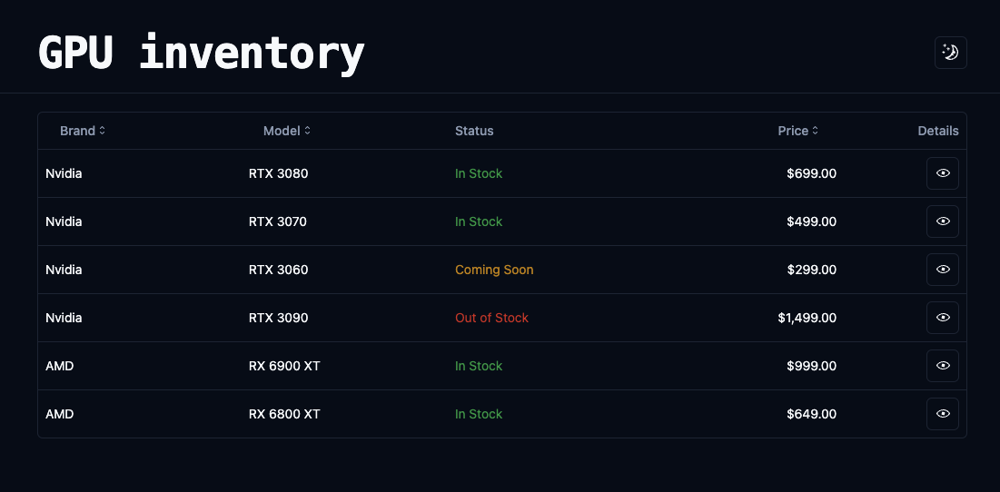
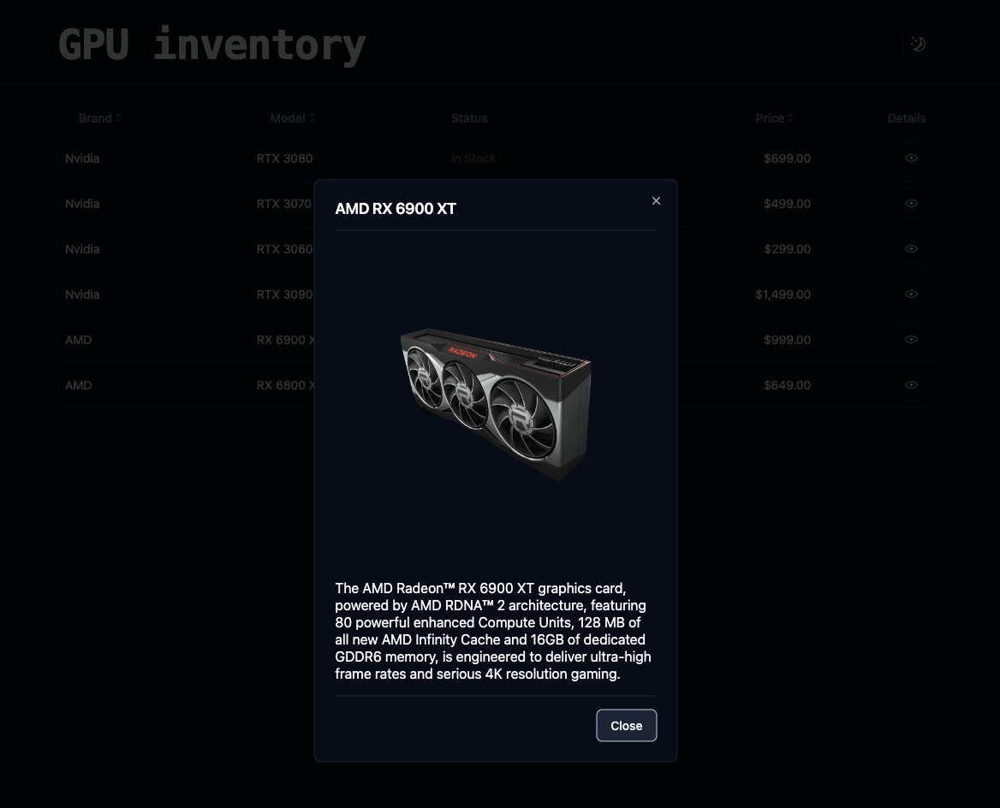

Inspiration from [Chris Kalmar's video](https://www.youtube.com/watch?v=AVT0FUKcvvk&ab_channel=ChrisKalmar).




## Stack

This repository utilizes a stack of technologies including, to make sure FE-BE API is typesafe with automatic contract generation:

- Tsoa: a typesafe framework for generating contracts
- Next.js: a React framework for building frontend applications
- Tanstack Query: a powerful data-fetching library
- Tailwind: a utility-first CSS framework
- shadcn/ui: a UI component library

## Architecture

This project consists of a backend utilizing Tsoa and a frontend built with Next.js. Both components are essential for the project's functionality. It is recommended to run them in separate terminal instances.

## Backend

### Install

```bash
cd backend
npm install
```

### Development

```bash
npm run dev
```

## Frontend

### Install

```bash
cd frontend
npm install
```

### Development

```bash
npm run dev
```
